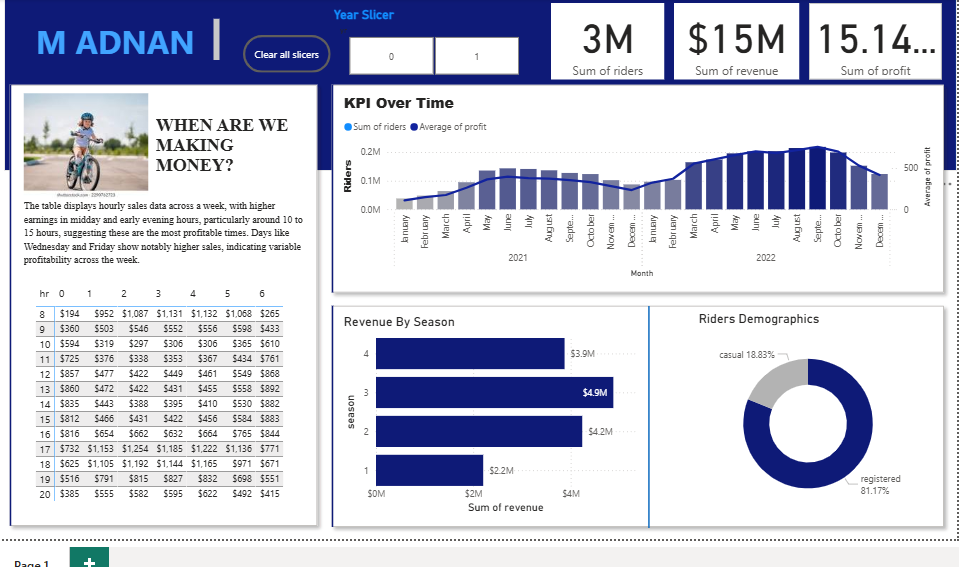

# Bike Shop Sales & Profitability Analysis

Two years of hourly bike-rental data (a public bike-share-style dataset, not
client data), analysed in SQL and Power BI to answer: when is the business
actually making money, and is the profit number believable?

That second question turned out to matter. The first version of this project
had a bug that made profit look almost as large as revenue.

## The bug, and why it's worth mentioning

`cost.csv` gives a price and a cost **per rider** for each year (e.g. $3.99
price / $1.24 cost). The original query joined that onto every row and
computed `profit = revenue - COGS` — subtracting the per-rider cost **once
per row**, no matter whether that row had 3 riders or 300. That under-counted
total cost by about 97% and produced a 99.7% profit margin: a number no real
bike-rental business would have, and one that should have been questioned
before it went in a KPI card.

The fix scales cost by volume, the same way revenue already was:
`profit = revenue - (riders * COGS)`. That drops the margin to **68.8%** —
which lines up with the per-unit numbers in `cost.csv` themselves
(`(3.99-1.24)/3.99 = 69%`, `(4.99-1.56)/4.99 = 69%`), so it's internally
consistent, not just a smaller number.

`verify_numbers.py` rebuilds `Cleaned_data.csv` from the three raw files and
prints every figure below, so the README can't quietly drift from the data.

## What the corrected numbers say

- **3,292,679 total rides, $15,187,365 total revenue, $10,448,579 total profit (68.8% margin).**
- **Registered riders are 81.3% of revenue**, casual riders 18.7%.
- **Season 3 generated the most revenue ($4.88M)**, not Season 2 as the
  original write-up claimed — the dashboard's own chart already showed this
  correctly; only the text summary had it backwards.
- **Revenue peaks are commute hours — 5–6 PM and 8 AM** — not "midday, 10 AM
  to 3 PM" as the original claimed. This is a bike-*share* pattern (people
  riding to and from work), which is a more useful thing to tell a
  stakeholder than "midday is busy."
- **Revenue by day of week is fairly even** (the highest day is about 10%
  above the lowest) — there's no standout "Wednesday and Friday" spike in the
  actual numbers.

## Files

| File | What it is |
|---|---|
| `year_01.csv`, `year_02.csv` | Raw hourly rider counts by season/weekday/hour/rider type, one year each |
| `cost.csv` | Price and cost per rider, by year |
| `verify_numbers.py` | Rebuilds `Cleaned_data.csv` from the three raw files and prints every number above |
| `Cleaned_data.csv` | The rebuilt, corrected output — what the dashboard should be pointed at |
| `SQL Query.sql` | The same join and calculation in SQL, for a database that already has these three tables loaded |
| `Bike Data Analysis.pbix` | The Power BI dashboard: KPI cards, revenue over time, revenue by season, rider-type split, an hourly table |

## Dashboard (pending refresh — see the note below)



## Known open item

The `.pbix` file still shows the original $15.14M profit figure — Power BI
dashboards don't update from a re-run script the way a Python or SQL project
does. **Open it in Power BI Desktop, refresh the data source against the
rebuilt `Cleaned_data.csv`, and update the "when are we making money" text
box** to describe the commute-hour pattern instead of the midday one. Until
that refresh happens, treat the numbers in this README as the correct ones,
not the numbers currently shown in the dashboard screenshot.

## Running it

```bash
pip install pandas
python verify_numbers.py
```

Built with SQL and Power BI (DAX/Power Query), verified with Python (pandas).

## Contact

Muhammad Adnan, [LinkedIn](https://linkedin.com/in/muhammad-adnan-740336293),
adnandanish0404@gmail.com
